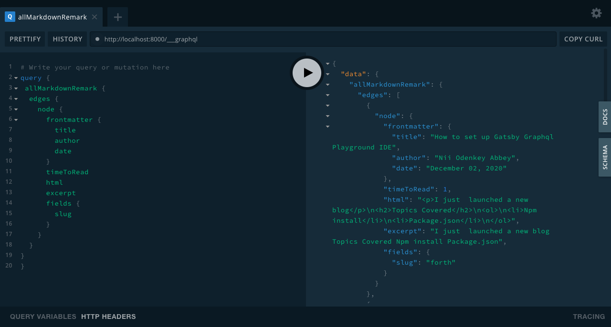

I just  launched a new blog

```jsx
<Flex spaceBetween>
            <Direction path="/blog" text="back to blog" direction="left" onCursor={onCursor}/>
            {
                next && (
                    <Direction path={path} text="keep reading . . ." text2={next.frontmatter.title}
                               direction="right" onCursor={onCursor}/>
                )
            }
</Flex>
```
```jsx
<div>
    <h1>
        this is a test
    </h1>
</div>
```
## Topics Covered

1. Playground vs Graphiql
2. Environmental variables
3. Npm install
4. Package.json
